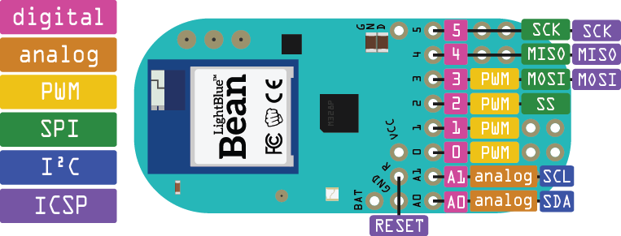

# Custom pad for computer control

The aim here is to use a gamepad or a custom pad to control development functions such as run, stop, debug, step in, step out, etc

## ControllerMate

Controller mate is a Mac applicaton to map virtually any gamepad/midi input to keyboard and mouse actions, keystrokes, sequences, etc



## JoyToKey

Map controller to keyboard action on windows



## Keypad reading

How to read keypad input using only one analog input.



## Lightblue bean 

Legacy docs: [https://punchthrough.com/bean/](https://punchthrough.com/bean/)

### Pinout

### Saving energy

[https://punchthrough.github.io/bean-docs/guides/features/power-management/](https://punchthrough.github.io/bean-docs/guides/features/power-management/)

